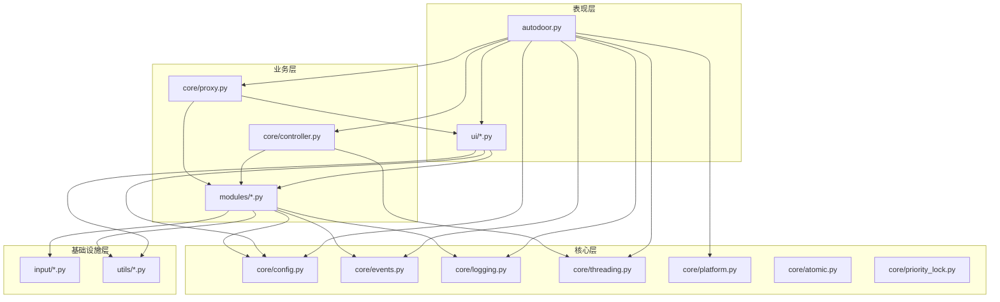

# AutoDoor 项目架构文档

## 版本信息

| 项目 | 内容 |
|------|------|
| 文档版本 | v2.3.2 |
| 项目版本 | v2.3.2 |
| 适用范围 | AutoDoor OCR 识别系统 |

---

## 1. 系统概述

### 1.1 项目简介

AutoDoor 是一个基于 OCR 的自动识别和操作系统，主要功能包括：

1. **文字识别**：监控指定屏幕区域，识别关键词并触发相应动作
2. **定时功能**：按照设定的时间间隔执行按键操作
3. **数字识别**：监控指定区域的数字变化并触发动作
4. **图像检测**：基于OpenCV模板匹配，检测屏幕区域中的目标图像
5. **脚本执行**：支持录制和执行自动化脚本
6. **颜色识别**：识别屏幕颜色变化并触发动作
7. **后台监控**：支持后台监控指定窗口，无需窗口置顶
8. **报警功能**：在触发动作时播放报警声音

### 1.2 技术栈

| 技术 | 用途 |
|------|------|
| Python 3.12 | 主要开发语言 |
| CustomTkinter | 现代GUI框架 |
| Tesseract OCR | 文字识别引擎 |
| PyAutoGUI | 鼠标键盘自动化（标准版） |
| DD虚拟键盘 | 驱动级键盘模拟（DD版） |
| Pygame | 音频播放 |
| PIL/Pillow | 图像处理 |
| pynput | 全局键盘监听 |
| OpenCV | 图像检测（模板匹配） |
| Win32 API | 窗口捕获与后台操作 |

---

## 2. 系统架构

### 2.1 整体架构图

```
┌────────────────────────────────────────────────────────────────────────────┐
│                              AutoDoor OCR 系统                             │
├────────────────────────────────────────────────────────────────────────────┤
│                                                                            │
│  ┌─────────────────────────────────────────────────────────────────────┐   │
│  │                        表现层 (Presentation Layer)                   │   │
│  │  ┌─────────────────────────────────────────────────────────────┐    │   │
│  │  │  autodoor.py - 应用入口、主窗口、生命周期管理                  │    │   │
│  │  │  ui/*.py - 各标签页、UI组件、样式、验证器                      │    │   │
│  │  └─────────────────────────────────────────────────────────────┘    │   │
│  └─────────────────────────────────────────────────────────────────────┘   │
│                                    │                                       │
│                                    ▼                                       │
│  ┌─────────────────────────────────────────────────────────────────────┐   │
│  │                        业务层 (Business Layer)                       │   │
│  │  ┌─────────────────────────────────────────────────────────────┐    │   │
│  │  │  modules/*.py - OCR、定时、数字识别、图像检测、脚本、颜色识别   │    │   │
│  │  │               后台监控                                        │    │   │
│  │  │  core/controller.py - 模块控制器                             │    │   │
│  │  │  core/proxy.py - 功能代理类                                  │    │   │
│  │  └─────────────────────────────────────────────────────────────┘    │   │
│  └─────────────────────────────────────────────────────────────────────┘   │
│                                    │                                       │
│                                    ▼                                       │
│  ┌─────────────────────────────────────────────────────────────────────┐   │
│  │                        核心层 (Core Layer)                           │   │
│  │  ┌─────────────────────────────────────────────────────────────┐    │   │
│  │  │  core/config.py - 配置管理                                   │    │   │
│  │  │  core/events.py - 事件管理                                   │    │   │
│  │  │  core/logging.py - 日志管理                                  │    │   │
│  │  │  core/threading.py - 线程管理                                │    │   │
│  │  │  core/platform.py - 平台适配                                 │    │   │
│  │  │  core/utils.py - 通用工具                                    │    │   │
│  │  │  core/atomic.py - 原子操作与状态管理                          │    │   │
│  │  │  core/priority_lock.py - 优先级锁                            │    │   │
│  │  │  core/click_handler.py - 点击处理                            │    │   │
│  │  └─────────────────────────────────────────────────────────────┘    │   │
│  └─────────────────────────────────────────────────────────────────────┘   │
│                                    │                                       │
│                                    ▼                                       │
│  ┌─────────────────────────────────────────────────────────────────────┐   │
│  │                    基础设施层 (Infrastructure Layer)                 │   │
│  │  ┌─────────────────────────────────────────────────────────────┐    │   │
│  │  │  input/*.py - 输入控制、权限管理                              │    │   │
│  │  │  utils/*.py - 图像处理、键盘操作、区域选择、OCR管理、截图管理   │    │   │
│  │  │              窗口捕获、坐标转换、快速切换、统一识别             │    │   │
│  │  └─────────────────────────────────────────────────────────────┘    │   │
│  └─────────────────────────────────────────────────────────────────────┘   │
│                                                                            │
└────────────────────────────────────────────────────────────────────────────┘
```

### 2.2 目录结构

```
autodoor/
├── autodoor.py              # 主应用入口文件
│
├── ui/                      # 用户界面层
│   ├── background_tab.py    # 后台监控标签页（新增）
│   ├── basic_tab.py         # 基本设置标签页
│   ├── home.py              # 首页标签页
│   ├── image_tab.py         # 图像检测标签页
│   ├── number_tab.py        # 数字识别标签页
│   ├── ocr_tab.py           # 文字识别标签页
│   ├── script_tab.py        # 脚本运行标签页
│   ├── theme.py             # 主题配置
│   ├── timed_tab.py         # 定时功能标签页
│   ├── utils.py             # UI 通用工具函数
│   └── widgets.py           # 自定义组件
│
├── core/                    # 核心功能层
│   ├── atomic.py            # 原子操作与状态管理
│   ├── config.py            # 配置管理器
│   ├── controller.py        # 模块控制器
│   ├── events.py            # 事件管理器
│   ├── logging.py           # 日志管理器
│   ├── platform.py          # 平台适配器
│   ├── priority_lock.py     # 优先级锁
│   ├── proxy.py             # 功能代理类
│   ├── threading.py         # 线程管理器
│   └── utils.py             # 核心工具函数
│
├── modules/                 # 业务功能模块
│   ├── alarm.py             # 报警模块
│   ├── background.py        # 后台监控模块（新增）
│   ├── color.py             # 颜色识别模块
│   ├── image.py             # 图像检测模块
│   ├── input.py             # 键盘事件执行器
│   ├── number.py            # 数字识别模块
│   ├── ocr.py               # OCR 识别模块
│   ├── recorder.py          # 录制模块
│   ├── script.py            # 脚本执行器
│   └── timed.py             # 定时功能模块
│
├── input/                   # 输入控制层
│   ├── __init__.py          # 模块初始化
│   ├── base.py              # 输入控制器抽象基类
│   ├── controller.py        # 输入控制器工厂
│   ├── pyautogui_input.py   # PyAutoGUI输入实现（标准版）
│   ├── dd_input.py          # DD虚拟键盘输入实现（DD版）
│   ├── key_mapping.py       # 按键映射表
│   ├── keyboard.py          # 键盘操作与快捷键
│   └── permissions.py       # 权限管理
│
├── drivers/                 # 驱动文件
│   └── DD64.dll             # DD虚拟键盘驱动（DD版专用）
│
├── hooks/                   # PyInstaller钩子
│   └── hook_dd_input.py     # DD版环境变量设置钩子
│
├── utils/                   # 工具函数层
│   ├── coordinate.py        # 坐标转换工具（新增）
│   ├── image.py             # 图像处理工具
│   ├── keyboard.py          # 键盘操作工具
│   ├── quick_switch.py      # 快速窗口切换（新增）
│   ├── recognition.py       # 统一识别工具类（新增）
│   ├── region.py            # 区域选择工具
│   ├── screenshot.py        # 截图管理器（单例）
│   ├── tesseract.py         # Tesseract OCR 管理
│   ├── version.py           # 版本检查工具
│   └── window_capture.py    # 窗口捕获工具（新增）
│
├── tesseract/               # Tesseract OCR 引擎
│   ├── tessdata/            # 语言数据
│   └── *.dll                # 依赖库
│
└── voice/                   # 音频资源
    ├── alarm.mp3            # 报警音效
    └── temp_reversed.mp3    # 停止音效
```

---

## 3. 模块划分与职责

### 3.1 表现层模块

| 模块 | 文件 | 职责 | 主要接口 |
|------|------|------|----------|
| 主应用 | `autodoor.py` | 应用入口、生命周期管理、模块协调 | `AutoDoorOCR` 类 |
| 首页 | `ui/home.py` | 首页标签页创建、状态显示 | `create_home_tab()` |
| OCR标签页 | `ui/ocr_tab.py` | OCR标签页创建、组管理 | `create_ocr_tab()`, `create_ocr_group()` |
| 定时标签页 | `ui/timed_tab.py` | 定时功能标签页创建 | `create_timed_tab()`, `create_timed_group()` |
| 数字标签页 | `ui/number_tab.py` | 数字识别标签页创建 | `create_number_tab()`, `create_number_region()` |
| 图像标签页 | `ui/image_tab.py` | 图像检测标签页创建 | `create_image_tab()`, `create_image_group()` |
| 脚本标签页 | `ui/script_tab.py` | 脚本运行标签页创建 | `create_script_tab()` |
| 基本设置 | `ui/basic_tab.py` | 基本设置标签页创建 | `create_basic_tab()` |
| 后台监控标签页 | `ui/background_tab.py` | 后台监控标签页创建、监控组管理 | `create_background_tab()`, `create_background_group()` |
| UI工具 | `ui/utils.py` | UI通用工具函数 | `show_message()`, `toggle_ui_state()` |
| 主题配置 | `ui/theme.py` | 全局主题配置 | `Theme` 类 |
| 自定义组件 | `ui/widgets.py` | 自定义UI组件 | 自定义控件类 |

### 3.2 业务层模块

| 模块 | 文件 | 职责 | 主要接口 |
|------|------|------|----------|
| OCR模块 | `modules/ocr.py` | OCR识别核心逻辑 | `start_monitoring()`, `stop_monitoring()` |
| 定时模块 | `modules/timed.py` | 定时任务执行 | `start_timed_tasks()`, `stop_timed_tasks()` |
| 数字识别模块 | `modules/number.py` | 数字识别逻辑 | `start_number_recognition()`, `stop_number_recognition()` |
| 图像检测模块 | `modules/image.py` | 图像检测逻辑（模板匹配） | `start_detection()`, `stop_detection()` |
| 脚本模块 | `modules/script.py` | 脚本录制与执行 | `start_script()`, `stop_script()`, `start_recording()` |
| 颜色识别模块 | `modules/color.py` | 颜色识别逻辑 | `start_color_recognition()`, `stop_color_recognition()` |
| 后台监控模块 | `modules/background.py` | 后台窗口监控、窗口捕获、坐标转换 | `start_monitoring()`, `stop_monitoring()`, `start_all_groups()` |
| 报警模块 | `modules/alarm.py` | 报警音效播放 | `play_alarm()`, `play_start_sound()`, `play_stop_sound()` |
| 输入执行器 | `modules/input.py` | 键盘事件执行 | `execute_key_press()` |
| 录制模块 | `modules/recorder.py` | 操作录制逻辑 | `start_recording()`, `stop_recording()` |

### 3.3 核心层模块

| 模块 | 文件 | 职责 | 主要接口 |
|------|------|------|----------|
| 配置管理器 | `core/config.py` | 配置读写、版本迁移 | `load_config()`, `save_config()`, `setup_config_listeners()` |
| 事件管理器 | `core/events.py` | 事件队列管理 | `add_event()`, `process_events()`, `clear_events()` |
| 日志管理器 | `core/logging.py` | 日志记录与显示 | `log_message()`, `clear_log()` |
| 线程管理器 | `core/threading.py` | 线程生命周期管理 | `start()`, `stop()`, `add_thread()` |
| 平台适配器 | `core/platform.py` | Windows平台适配 | `get_config_dir()`, `get_log_file_path()` |
| 模块控制器 | `core/controller.py` | 模块启停统一控制 | `start_all()`, `stop_all()`, `start_module()` |
| 代理类 | `core/proxy.py` | 功能模块代理封装 | `OCRProxy`, `TimedProxy`, `NumberProxy`, `ImageDetectionProxy`, `ScriptProxy`, `ColorProxy`, `BackgroundProxy`, `UIProxy` |
| 核心工具 | `core/utils.py` | 通用工具函数 | `exit_program()`, `add_group()`, `delete_group()` |
| 原子操作工具 | `core/atomic.py` | 原子操作与状态管理 | `AppState` 类 |
| 优先级锁 | `core/priority_lock.py` | 优先级锁实现 | 优先级锁相关类和方法 |

### 3.4 基础设施层模块

| 模块 | 文件 | 职责 | 主要接口 |
|------|------|------|----------|
| 输入控制器基类 | `input/base.py` | 输入控制器抽象接口定义 | `BaseInputController` 类 |
| 输入控制器工厂 | `input/controller.py` | 输入操作封装、工厂模式选择实现 | `InputController` 类, `create_input_controller()` |
| PyAutoGUI输入 | `input/pyautogui_input.py` | 标准版输入实现（PyAutoGUI） | `PyAutoGUIInput` 类 |
| DD虚拟键盘输入 | `input/dd_input.py` | DD版输入实现（驱动级模拟） | `DDVirtualInput` 类 |
| 按键映射 | `input/key_mapping.py` | 按键名称映射表 | `KEY_NAME_MAPPING`, `get_pyautogui_key()` |
| 键盘操作 | `input/keyboard.py` | 快捷键绑定、按键列表 | `setup_shortcuts()`, `get_available_keys()` |
| 权限管理 | `input/permissions.py` | Windows权限管理 | `check_all()`, `check_accessibility()`, `check_screen_recording()` |
| 图像处理 | `utils/image.py` | 图像预处理 | `preprocess_image()`, `capture_screen()` |
| 截图管理 | `utils/screenshot.py` | 截图管理（单例） | `ScreenshotManager` 类 |
| 区域选择 | `utils/region.py` | 屏幕区域选择 | `select_region()`, `cancel_selection()` |
| Tesseract管理 | `utils/tesseract.py` | OCR引擎管理 | `check_tesseract_availability()`, `set_tesseract_path()` |
| 版本检查 | `utils/version.py` | 版本更新检查 | `check_for_updates()`, `open_bilibili()` |
| 窗口捕获 | `utils/window_capture.py` | 后台窗口截图、窗口查找 | `capture_window()`, `find_window_by_title()`, `capture_window_region()` |
| 坐标转换 | `utils/coordinate.py` | 相对坐标与绝对坐标转换 | `RelativeCoordinate`, `WindowCoordinate` |
| 快速切换 | `utils/quick_switch.py` | 窗口快速切换操作 | `QuickSwitchBackend` 类 |
| 统一识别 | `utils/recognition.py` | OCR/图像/颜色/数字识别工具类 | `OCRRecognizer`, `ImageRecognizer`, `ColorRecognizer`, `NumberRecognizer` |

---

## 4. 模块间接口定义

### 4.1 核心接口规范

#### 4.1.1 配置管理器接口

```python
class ConfigManager:
    """配置管理器接口"""
    
    def read_config(self) -> dict | None:
        """读取配置文件"""
        pass
    
    def save_config(self, config: dict) -> bool:
        """保存配置文件"""
        pass
    
    def load_config(self) -> None:
        """加载并应用配置"""
        pass
    
    def get_full_config(self) -> dict:
        """获取完整配置数据"""
        pass
    
    def defer_save_config(self) -> None:
        """延迟保存配置（防抖）"""
        pass
    
    def setup_config_listeners(self) -> None:
        """设置配置变更监听器"""
        pass
```

#### 4.1.2 事件管理器接口

```python
class EventManager:
    """事件管理器接口"""
    
    def start_event_thread(self) -> None:
        """启动事件处理线程"""
        pass
    
    def add_event(self, event: tuple, module_info: tuple = None, priority: int = None) -> None:
        """添加事件到队列"""
        pass
    
    def clear_events(self) -> None:
        """清空事件队列"""
        pass
    
    def execute_event(self, event_data: tuple) -> None:
        """执行单个事件"""
        pass
```

#### 4.1.3 线程管理器接口

```python
class ThreadManager:
    """线程管理器接口"""
    
    def start(self, module: str, start_func: callable, stop_func: callable, log_prefix: str) -> int:
        """启动模块线程"""
        pass
    
    def stop(self, module: str, stop_func: callable, log_prefix: str) -> None:
        """停止模块线程"""
        pass
    
    def add_thread(self, module: str, thread: threading.Thread) -> None:
        """添加线程到管理器"""
        pass
    
    def get_threads(self, module: str) -> list:
        """获取模块的所有线程"""
        pass
```

#### 4.1.4 模块控制器接口

```python
class ModuleController:
    """模块控制器接口"""
    
    def start_module(self, module_name: str, start_func: callable) -> None:
        """统一启动模块"""
        pass
    
    def _execute_module_action(self, action: str) -> None:
        """统一执行模块操作（启动或停止）
        
        Args:
            action: 操作类型，"start" 或 "stop"
        
        说明：
            该方法通过遍历 MODULES 配置字典，统一处理所有模块的启动和停止操作。
            支持可选模块的存在性检查，支持带参数的方法调用。
        """
        pass
    
    def start_all(self) -> None:
        """启动所有已启用的模块
        
        说明：
            通过调用 _execute_module_action("start") 统一启动所有勾选的模块。
            会自动检查 checkbox 状态，只启动用户勾选的模块。
        """
        pass
    
    def stop_all(self) -> None:
        """停止所有模块
        
        说明：
            通过调用 _execute_module_action("stop") 统一停止所有模块。
            保留颜色识别模块的特殊处理逻辑。
        """
        pass
    
    def _update_indicator(self, module_key: str, is_running: bool) -> None:
        """更新模块指示灯状态
        
        Args:
            module_key: 模块标识键
            is_running: 是否运行中
        """
        pass
```

### 4.2 代理类接口

#### 4.2.1 OCR代理接口

```python
class OCRProxy:
    """OCR功能代理"""
    
    def create_tab(self, parent: tk.Widget) -> None:
        """创建OCR标签页"""
        pass
    
    def create_group(self, index: int) -> None:
        """创建OCR组"""
        pass
    
    def add_group(self) -> None:
        """新增OCR组"""
        pass
    
    def delete_group(self, index: int, confirm: bool = True) -> None:
        """删除OCR组"""
        pass
    
    def start_monitoring(self) -> None:
        """开始监控"""
        pass
    
    def stop_monitoring(self) -> None:
        """停止监控"""
        pass
```

#### 4.2.2 图像检测代理接口

```python
class ImageDetectionProxy:
    """图像检测功能代理"""
    
    def create_tab(self, parent: tk.Widget) -> None:
        """创建图像检测标签页"""
        pass
    
    def create_group(self, index: int) -> None:
        """创建检测组"""
        pass
    
    def add_group(self) -> None:
        """新增检测组"""
        pass
    
    def delete_group(self, index: int, confirm: bool = True) -> None:
        """删除检测组"""
        pass
    
    def start_detection(self) -> None:
        """开始检测"""
        pass
    
    def stop_detection(self) -> None:
        """停止检测"""
        pass
```

#### 4.2.3 后台监控代理接口

```python
class BackgroundProxy:
    """后台监控功能代理"""
    
    def create_tab(self, parent: tk.Widget) -> None:
        """创建后台监控标签页"""
        pass
    
    def create_group(self, index: int, monitor_type: str = "ocr") -> None:
        """创建监控组"""
        pass
    
    def add_group(self, monitor_type: str = "ocr") -> None:
        """新增监控组"""
        pass
    
    def delete_group(self, index: int, confirm: bool = True) -> None:
        """删除监控组"""
        pass
    
    def find_window(self) -> None:
        """查找目标窗口"""
        pass
    
    def start_monitoring(self) -> None:
        """开始后台监控"""
        pass
    
    def stop_monitoring(self) -> None:
        """停止后台监控"""
        pass
```

#### 4.2.4 脚本代理接口

```python
class ScriptProxy:
    """脚本功能代理"""
    
    def create_tab(self, parent: tk.Widget) -> None:
        """创建脚本标签页"""
        pass
    
    def start(self, start_color_recognition: bool = True) -> None:
        """启动脚本"""
        pass
    
    def stop(self, stop_color_recognition: bool = True) -> None:
        """停止脚本"""
        pass
    
    def start_recording(self) -> None:
        """开始录制"""
        pass
    
    def stop_recording(self) -> None:
        """停止录制"""
        pass
```

---

## 5. 数据流转流程

### 5.1 应用启动流程

```
┌─────────────────────────────────────────────────────────────────────────────┐
│                            应用启动流程                                      │
├─────────────────────────────────────────────────────────────────────────────┤
│                                                                             │
│  1. main()                                                                  │
│     │                                                                       │
│     ▼                                                                       │
│  2. AutoDoorOCR.__init__()                                                  │
│     │                                                                       │
│     ├──► _init_basic_settings()     # 初始化基础变量                         │
│     │                                                                       │
│     ├──► _init_platform()           # 初始化平台适配器                       │
│     │                                                                       │
│     ├──► _init_managers()           # 初始化管理器                           │
│     │    ├── LoggingManager                                                 │
│     │    ├── VersionChecker                                                 │
│     │    ├── InputController                                                │
│     │    ├── ThreadManager                                                  │
│     │    ├── EventManager                                                   │
│     │    ├── ConfigManager                                                  │
│     │    └── PermissionManager                                              │
│     │                                                                       │
│     ├──► _init_proxy_classes()      # 初始化代理类                           │
│     │    ├── OCRProxy                                                       │
│     │    ├── TimedProxy                                                     │
│     │    ├── NumberProxy                                                    │
│     │    ├── ImageDetectionProxy                                            │
│     │    ├── ScriptProxy                                                    │
│     │    ├── ColorProxy                                                     │
│     │    ├── BackgroundProxy                                                │
│     │    └── UIProxy                                                        │
│     │                                                                       │
│     ├──► _init_ui()                 # 初始化用户界面                         │
│     │    ├── 创建主窗口                                                     │
│     │    ├── 初始化Tkinter变量                                              │
│     │    └── create_widgets()                                               │
│     │                                                                       │
│     ├──► _init_modules()            # 初始化功能模块                         │
│     │    ├── OCRModule                                                      │
│     │    ├── TimedModule                                                    │
│     │    ├── NumberModule                                                   │
│     │    ├── ImageDetectionManager                                          │
│     │    ├── AlarmModule                                                    │
│     │    ├── ScriptModule                                                   │
│     │    ├── TesseractManager                                               │
│     │    ├── ColorRecognitionManager                                        │
│     │    └── BackgroundManager                                              │
│     │                                                                       │
│     ├──► _load_config()             # 加载配置                               │
│     │                                                                       │
│     └──► _start_services()          # 启动服务                               │
│          ├── 配置监听器                                                     │
│          ├── Tesseract检测                                                  │
│          ├── 快捷键绑定                                                     │
│          └── 事件处理线程                                                   │
│                                                                             │
│  3. run()                           # 进入主循环                             │
│                                                                             │
└─────────────────────────────────────────────────────────────────────────────┘
```

### 5.2 后台监控流程

```
┌─────────────────────────────────────────────────────────────────────────────┐
│                            后台监控流程                                      │
├─────────────────────────────────────────────────────────────────────────────┤
│                                                                             │
│  用户操作                                                                    │
│     │                                                                       │
│     ▼                                                                       │
│  ┌─────────────────┐                                                        │
│  │ 绑定目标窗口     │                                                        │
│  └────────┬────────┘                                                        │
│           │                                                                 │
│           ▼                                                                 │
│  ┌─────────────────────────────────────────────────────────────┐            │
│  │ BackgroundManager.find_target_window()                       │            │
│  │  ├── 输入窗口标题关键字                                       │            │
│  │  ├── 枚举所有窗口                                             │            │
│  │  └── 匹配并保存窗口句柄                                       │            │
│  └──────────────────────────┬──────────────────────────────────┘            │
│                             │                                               │
│                             ▼                                               │
│  ┌─────────────────────────────────────────────────────────────┐            │
│  │ BackgroundMonitor.start_monitoring()                         │            │
│  │  ├── 检查窗口句柄                                             │            │
│  │  ├── 检查监控区域                                             │            │
│  │  └── 启动监控线程                                             │            │
│  └──────────────────────────┬──────────────────────────────────┘            │
│                             │                                               │
│                             ▼                                               │
│  ┌─────────────────────────────────────────────────────────────┐            │
│  │ BackgroundMonitor._monitor_loop() [后台线程]                 │            │
│  │  │                                                          │            │
│  │  ├──► 等待检测间隔                                          │            │
│  │  │                                                          │            │
│  │  ├──► 循环处理                                              │            │
│  │  │    ├── 后台截取窗口区域 (PrintWindow API)                 │            │
│  │  │    ├── 执行识别 (OCR/图像/颜色)                           │            │
│  │  │    ├── 判断是否匹配                                       │            │
│  │  │    └── 触发动作（切换窗口→点击/按键→恢复窗口）             │            │
│  │  │                                                          │            │
│  │  └──► 检测停止信号，退出循环                                  │            │
│  └─────────────────────────────────────────────────────────────┘            │
│                                                                             │
└─────────────────────────────────────────────────────────────────────────────┘
```

### 5.3 图像检测流程

```
┌─────────────────────────────────────────────────────────────────────────────┐
│                            图像检测流程                                      │
├─────────────────────────────────────────────────────────────────────────────┤
│                                                                             │
│  用户操作                                                                    │
│     │                                                                       │
│     ▼                                                                       │
│  ┌─────────────────┐                                                        │
│  │ 点击"开始检测"   │                                                        │
│  └────────┬────────┘                                                        │
│           │                                                                 │
│           ▼                                                                 │
│  ┌─────────────────────────────────────────────────────────────┐            │
│  │ ImageDetection.start_detection()                            │            │
│  │  ├── 检查OpenCV可用性                                        │            │
│  │  ├── 检查模板图像                                            │            │
│  │  ├── 检查检测区域                                            │            │
│  │  └── 启动检测线程                                            │            │
│  └──────────────────────────┬──────────────────────────────────┘            │
│                             │                                               │
│                             ▼                                               │
│  ┌─────────────────────────────────────────────────────────────┐            │
│  │ ImageDetection.detect() [后台线程]                          │            │
│  │  │                                                          │            │
│  │  ├──► 等待检测间隔                                          │            │
│  │  │                                                          │            │
│  │  ├──► 循环处理                                              │            │
│  │  │    ├── 截取屏幕区域                                       │            │
│  │  │    ├── OpenCV模板匹配                                     │            │
│  │  │    ├── 计算匹配度                                         │            │
│  │  │    ├── 判断是否超过阈值                                   │            │
│  │  │    └── 触发动作（点击/按键）                               │            │
│  │  │                                                          │            │
│  │  └──► 检测停止信号，退出循环                                  │            │
│  └─────────────────────────────────────────────────────────────┘            │
│                                                                             │
└─────────────────────────────────────────────────────────────────────────────┘
```

### 5.4 事件处理流程

```
┌─────────────────────────────────────────────────────────────────────────────┐
│                            事件处理流程                                      │
├─────────────────────────────────────────────────────────────────────────────┤
│                                                                             │
│  事件源                                                                      │
│  (OCR识别/定时任务/数字识别/图像检测/脚本/后台监控)                            │
│     │                                                                       │
│     ▼                                                                       │
│  ┌─────────────────────────────────────────────────────────────┐            │
│  │ EventManager.add_event(event, module_info, priority)        │            │
│  │  ├── 确定优先级                                              │            │
│  │  └── 添加到优先级队列                                         │            │
│  └──────────────────────────┬──────────────────────────────────┘            │
│                             │                                               │
│                             ▼                                               │
│  ┌─────────────────────────────────────────────────────────────┐            │
│  │ PriorityQueue [(priority, event, module_info), ...]         │            │
│  └──────────────────────────┬──────────────────────────────────┘            │
│                             │                                               │
│                             ▼                                               │
│  ┌─────────────────────────────────────────────────────────────┐            │
│  │ EventManager.process_events() [后台线程]                     │            │
│  │  │                                                          │            │
│  │  ├──► 循环取出事件                                           │            │
│  │  │    ├── execute_event(event_data)                         │            │
│  │  │    │   ├── 解析事件类型                                   │            │
│  │  │    │   ├── 执行对应操作                                   │            │
│  │  │    │   │   ├── 鼠标点击                                   │            │
│  │  │    │   │   ├── 键盘按键                                   │            │
│  │  │    │   │   ├── 播放报警                                   │            │
│  │  │    │   │   └── 执行脚本                                   │            │
│  │  │    │   └── 更新状态                                       │            │
│  │  │    └── task_done()                                       │            │
│  │  │                                                          │            │
│  │  └──► 检测停止信号，退出循环                                  │            │
│  └─────────────────────────────────────────────────────────────┘            │
│                                                                             │
└─────────────────────────────────────────────────────────────────────────────┘
```

### 5.5 配置管理流程

```
┌────────────────────────────────────────────────────────────────────────────┐
│                            配置管理流程                                     │
├────────────────────────────────────────────────────────────────────────────┤
│                                                                            │
│  ┌─────────────────────────────────────────────────────────────────────┐   │
│  │                         配置加载流程                                 │   │
│  │                                                                     │   │
│  │  ConfigManager.load_config()                                        │   │
│  │     │                                                               │   │
│  │     ├── read_config() ──► 读取JSON文件                               │   │
│  │     │                                                               │   │
│  │     ├── _process_config() ──► 处理配置数据                           │   │
│  │     │    ├── 版本迁移                                                │   │
│  │     │    ├── 加载OCR组配置                                           │   │
│  │     │    ├── 加载定时组配置                                           │   │
│  │     │    ├── 加载数字识别配置                                         │   │
│  │     │    ├── 加载图像检测配置                                         │   │
│  │     │    └── 加载后台监控配置                                         │   │
│  │     │                                                               │   │
│  │     └── 应用配置到UI组件                                             │   │
│  │                                                                     │   │
│  └─────────────────────────────────────────────────────────────────────┘   │
│                                                                            │
│  ┌─────────────────────────────────────────────────────────────────────┐   │
│  │                         配置保存流程                                 │   │
│  │                                                                     │   │
│  │  用户修改配置                                                        │   │
│  │     │                                                               │   │
│  │     ▼                                                               │   │
│  │  Tkinter Variable 变更                                              │   │
│  │     │                                                               │   │
│  │     ▼                                                               │   │
│  │  trace_add() 回调                                                   │   │
│  │     │                                                               │   │
│  │     ▼                                                               │   │
│  │  ConfigManager.defer_save_config() ──► 防抖处理                      │   │
│  │     │                                                               │   │
│  │     ▼                                                               │   │
│  │  ConfigManager.save_config()                                        │   │
│  │     │                                                               │   │
│  │     ├── get_full_config() ──► 收集所有配置                           │   │
│  │     │                                                               │   │
│  │     └── 写入JSON文件                                                 │   │
│  │                                                                     │   │
│  └─────────────────────────────────────────────────────────────────────┘   │
│                                                                            │
└────────────────────────────────────────────────────────────────────────────┘
```

---

## 6. 核心功能实现方案

### 6.1 OCR文字识别

#### 6.1.1 实现原理

```
┌─────────────────────────────────────────────────────────────────────────────┐
│                         OCR文字识别实现                                      │
├─────────────────────────────────────────────────────────────────────────────┤
│                                                                             │
│  1. 屏幕截图                                                                 │
│     └── 使用 PIL.ImageGrab 截取指定区域                                       │
│                                                                             │
│  2. 图像预处理                                                               │
│     ├── 灰度转换                                                             │
│     ├── 二值化处理                                                           │
│     ├── 降噪处理                                                             │
│     └── 对比度增强                                                           │
│                                                                             │
│  3. OCR识别                                                                 │
│     └── 调用 Tesseract OCR 引擎                                              │
│                                                                             │
│  4. 结果处理                                                                 │
│     ├── 关键词匹配                                                           │
│     ├── 触发条件判断                                                         │
│     └── 执行对应动作                                                         │
│                                                                             │
└─────────────────────────────────────────────────────────────────────────────┘
```

#### 6.1.2 关键代码

```python
def perform_ocr_for_group(self, group, group_index):
    """执行OCR识别"""
    region = group['region']
    
    screenshot = ImageGrab.grab(bbox=region)
    processed_image = preprocess_image(screenshot)
    
    text = pytesseract.image_to_string(
        processed_image,
        lang=group['language'].get(),
        config='--psm 6'
    )
    
    keywords = group['keywords'].get().split(',')
    for keyword in keywords:
        if keyword.strip().lower() in text.lower():
            self.trigger_action(group)
            break
```

### 6.2 图像检测

#### 6.2.1 实现原理

```
┌─────────────────────────────────────────────────────────────────────────────┐
│                         图像检测实现（OpenCV模板匹配）                         │
├─────────────────────────────────────────────────────────────────────────────┤
│                                                                             │
│  1. 模板准备                                                                 │
│     ├── 从本地文件加载模板图像                                                │
│     └── 或通过截图功能截取屏幕区域作为模板                                      │
│                                                                             │
│  2. 屏幕截图                                                                 │
│     └── 截取指定检测区域的屏幕图像                                             │
│                                                                             │
│  3. 模板匹配                                                                 │
│     ├── 使用 cv2.matchTemplate 进行模板匹配                                   │
│     ├── 计算匹配度（0-100%）                                                  │
│     └── 与阈值比较判断是否匹配成功                                            │
│                                                                             │
│  4. 结果处理                                                                 │
│     ├── 匹配成功：获取匹配位置，执行点击/按键动作                               │
│     └── 匹配失败：继续下一轮检测                                              │
│                                                                             │
└─────────────────────────────────────────────────────────────────────────────┘
```

#### 6.2.2 关键代码

```python
def detect_image(self):
    """执行图像检测 - 模板匹配"""
    # 截取屏幕区域
    screenshot = screenshot_manager.get_region_screenshot(self.region)
    screenshot_cv = cv2.cvtColor(np.array(screenshot), cv2.COLOR_RGB2BGR)
    
    # 模板匹配
    result = cv2.matchTemplate(screenshot_cv, self.template_image, cv2.TM_CCOEFF_NORMED)
    min_val, max_val, min_loc, max_loc = cv2.minMaxLoc(result)
    
    # 判断匹配度
    if max_val >= self.threshold:
        # 匹配成功，计算中心位置
        center_x = max_loc[0] + template_w // 2
        center_y = max_loc[1] + template_h // 2
        return (abs_x, abs_y, max_val)
    return None
```

### 6.3 后台监控

#### 6.3.1 实现原理

```
┌─────────────────────────────────────────────────────────────────────────────┐
│                         后台监控实现                                         │
├─────────────────────────────────────────────────────────────────────────────┤
│                                                                             │
│  1. 窗口绑定                                                                 │
│     ├── 通过标题关键字查找目标窗口                                            │
│     ├── 保存窗口句柄 (HWND)                                                  │
│     └── 支持多窗口选择                                                       │
│                                                                             │
│  2. 后台截图                                                                 │
│     ├── 使用 PrintWindow API 截取窗口内容                                     │
│     ├── 支持最小化窗口截图                                                   │
│     └── 支持指定区域截图                                                     │
│                                                                             │
│  3. 坐标系统                                                                 │
│     ├── 窗口相对坐标（相对于窗口左上角）                                       │
│     ├── 比例坐标（支持分辨率自适应）                                          │
│     └── 自动转换绝对/相对坐标                                                │
│                                                                             │
│  4. 识别与触发                                                               │
│     ├── 支持 OCR/图像/颜色 三种识别类型                                       │
│     ├── 快速切换到目标窗口                                                   │
│     ├── 执行点击/按键操作                                                    │
│     └── 自动恢复原窗口                                                      │
│                                                                             │
└─────────────────────────────────────────────────────────────────────────────┘
```

#### 6.3.2 关键代码

```python
def capture_window(hwnd: int) -> Optional[Image.Image]:
    """后台截图 - 使用PrintWindow API"""
    hwndDC = win32gui.GetWindowDC(hwnd)
    mfcDC = win32ui.CreateDCFromHandle(hwndDC)
    saveDC = mfcDC.CreateCompatibleDC()
    
    saveBitMap = win32ui.CreateBitmap()
    saveBitMap.CreateCompatibleBitmap(mfcDC, width, height)
    saveDC.SelectObject(saveBitMap)
    
    # 使用PrintWindow API实现后台截图
    ctypes.windll.user32.PrintWindow(hwnd, saveDC.GetSafeHdc(), 2)
    
    return img
```

### 6.4 定时功能

#### 6.4.1 实现原理

```
┌────────────────────────────────────────────────────────────────────────────┐
│                          定时功能实现                                       │
├────────────────────────────────────────────────────────────────────────────┤
│                                                                            │
│  1. 任务配置                                                                │
│     ├── 时间间隔设置                                                        │
│     ├── 按键类型选择                                                        │
│     └── 启用状态管理                                                        │
│                                                                            │
│  2. 任务调度                                                                │
│     ├── 创建定时线程                                                         │
│     ├── 计算下次执行时间                                                     │
│     └── 等待并执行                                                          │
│                                                                            │
│  3. 任务执行                                                                │
│     ├── 按键操作                                                            │
│     ├── 状态更新                                                            │
│     └── 日志记录                                                            │
│                                                                            │
└────────────────────────────────────────────────────────────────────────────┘
```

### 6.5 数字识别

#### 6.5.1 实现原理

```
┌─────────────────────────────────────────────────────────────────────────────┐
│                          数字识别实现                                        │
├─────────────────────────────────────────────────────────────────────────────┤
│                                                                             │
│  1. 区域监控                                                                 │
│     └── 定期截取指定区域                                                      │
│                                                                             │
│  2. 数字提取                                                                 │
│     ├── OCR识别文本                                                          │
│     └── 正则提取数字                                                         │
│                                                                             │
│  3. 条件判断                                                                 │
│     ├── 大于阈值                                                             │
│     ├── 小于阈值                                                             │
│     ├── 等于阈值                                                             │
│     └── 变化检测                                                             │
│                                                                             │
│  4. 动作触发                                                                 │
│     └── 根据条件执行对应动作                                                  │
│                                                                             │
└─────────────────────────────────────────────────────────────────────────────┘
```

### 6.6 脚本执行

#### 6.6.1 实现原理

```
┌─────────────────────────────────────────────────────────────────────────────┐
│                          脚本执行实现                                        │
├─────────────────────────────────────────────────────────────────────────────┤
│                                                                             │
│  1. 脚本录制                                                                 │
│     ├── 监听键盘事件                                                         │
│     ├── 监听鼠标事件                                                         │
│     └── 记录操作序列                                                         │
│                                                                             │
│  2. 脚本解析                                                                 │
│     ├── 解析命令类型                                                         │
│     ├── 提取参数                                                             │
│     └── 构建执行队列                                                         │
│                                                                             │
│  3. 脚本执行                                                                 │
│     ├── 顺序执行命令                                                         │
│     ├── 支持循环结构                                                         │
│     ├── 支持条件分支                                                         │
│     └── 支持暂停/恢复                                                        │
│                                                                             │
└─────────────────────────────────────────────────────────────────────────────┘
```

---

## 7. 依赖关系管理

### 7.1 模块依赖关系图



### 7.2 外部依赖

| 依赖包 | 版本要求 | 用途 |
|--------|----------|------|
| customtkinter | >=5.2.0 | 现代GUI框架 |
| PIL/Pillow | >=10.0.0 | 图像处理 |
| pyautogui | >=0.9.54 | 自动化操作 |
| pytesseract | >=0.3.10 | OCR接口 |
| pygame | >=2.0.0 | 音频播放 |
| pynput | >=1.7.6 | 键盘监听 |
| imagehash | >=4.3.2 | 图像哈希 |
| screeninfo | >=0.8.1 | 屏幕信息 |
| opencv-python-headless | >=4.8.0 | 图像检测（无GUI版本） |
| numpy | >=1.21.0 | 数值计算 |
| requests | >=2.31.0 | HTTP请求 |
| pywin32 | >=305 | Windows API调用 |

### 7.3 依赖注入模式

项目采用构造函数注入模式，所有模块通过 `app` 参数接收主应用实例：

```python
class BackgroundMonitor:
    def __init__(self, app):
        self.app = app  # 注入主应用实例
        
    def start_monitoring(self):
        # 通过 app 访问其他模块
        self.app.logging_manager.log_message("开始监控")
```

---

## 8. 扩展性设计

### 8.1 新增功能模块

#### 步骤1：创建模块文件

```python
# modules/new_feature.py
class NewFeatureModule:
    def __init__(self, app):
        self.app = app
    
    def start(self):
        """启动功能"""
        pass
    
    def stop(self):
        """停止功能"""
        pass
```

#### 步骤2：创建代理类

```python
# core/proxy.py (添加)
class NewFeatureProxy:
    def __init__(self, app):
        self.app = app
    
    def start(self):
        self.app.new_feature_module.start()
    
    def stop(self):
        self.app.new_feature_module.stop()
```

#### 步骤3：注册到主应用

```python
# autodoor.py
def _init_modules(self):
    # ... 现有模块
    self.new_feature_module = NewFeatureModule(self)
    
    # 在 MODULES 配置中添加新模块
    self.MODULES["new_feature"] = {
        "threads": "new_feature_threads",          # 线程管理器中的线程组名称
        "stop_func": "new_feature.stop",           # 停止方法路径（相对于app）
        "start_func": "new_feature.start",         # 启动方法路径（相对于app）
        "label": "新功能",                         # 模块显示名称
        "object_path": "new_feature_module",       # 模块对象路径（相对于app）
        "optional": False,                         # 是否为可选模块（可选）
        "stop_kwargs": {}                          # 停止方法的额外参数（可选）
    }
```

**MODULES 配置字段说明：**

| 字段 | 类型 | 必填 | 说明 |
|------|------|------|------|
| `threads` | str | 是 | 线程管理器中的线程组名称 |
| `stop_func` | str | 是 | 停止方法路径，格式为 "对象.方法名" |
| `start_func` | str | 是 | 启动方法路径，格式为 "对象.方法名" |
| `label` | str | 是 | 模块显示名称，用于日志和UI |
| `object_path` | str | 是 | 模块对象路径，用于检查模块是否存在 |
| `optional` | bool | 否 | 是否为可选模块，默认为 False |
| `stop_kwargs` | dict | 否 | 停止方法的额外参数，默认为空字典 |

**配置示例：**

```python
# 必需模块示例
"ocr": {
    "threads": "ocr_threads",
    "stop_func": "ocr.stop_monitoring",
    "start_func": "ocr.start_monitoring",
    "label": "文字识别",
    "object_path": "ocr"
}

# 可选模块示例
"background": {
    "threads": "background_threads",
    "stop_func": "background.stop_monitoring",
    "start_func": "background_manager.start_all_groups",
    "label": "后台监控",
    "object_path": "background_manager",
    "optional": True  # 标记为可选模块
}

# 带参数的停止方法示例
"script": {
    "threads": "script_threads",
    "stop_func": "script.stop",
    "start_func": "script.start",
    "label": "脚本执行",
    "object_path": "script",
    "stop_kwargs": {"stop_color_recognition": False}  # 停止时传递额外参数
}
```

#### 步骤4：创建UI标签页

```python
# ui/new_feature_tab.py
def create_new_feature_tab(parent, app):
    """创建新功能标签页"""
    # UI构建逻辑
    pass
```

### 8.2 插件化架构（未来规划）

```python
# core/plugin.py
class PluginInterface:
    """插件接口"""
    
    @property
    def name(self) -> str:
        """插件名称"""
        pass
    
    @property
    def version(self) -> str:
        """插件版本"""
        pass
    
    def on_load(self, app):
        """加载时调用"""
        pass
    
    def on_unload(self, app):
        """卸载时调用"""
        pass
    
    def get_ui(self, parent):
        """获取UI组件"""
        pass


class PluginManager:
    """插件管理器"""
    
    def __init__(self, app):
        self.app = app
        self.plugins = {}
    
    def register(self, plugin: PluginInterface):
        """注册插件"""
        self.plugins[plugin.name] = plugin
        plugin.on_load(self.app)
    
    def unregister(self, name: str):
        """卸载插件"""
        if name in self.plugins:
            self.plugins[name].on_unload(self.app)
            del self.plugins[name]
```

### 8.3 事件订阅机制

```python
# 扩展 EventManager 支持订阅
class EventManager:
    def __init__(self, app):
        self.app = app
        self.event_queue = queue.PriorityQueue()
        self.subscribers = {}  # 新增：事件订阅者
    
    def subscribe(self, event_type: str, handler: callable):
        """订阅事件"""
        if event_type not in self.subscribers:
            self.subscribers[event_type] = []
        self.subscribers[event_type].append(handler)
    
    def publish(self, event_type: str, data: any):
        """发布事件"""
        if event_type in self.subscribers:
            for handler in self.subscribers[event_type]:
                handler(data)
```

---

## 9. 调用示例

### 9.1 基本使用

```python
# 启动应用
app = AutoDoorOCR()
app.run()
```

### 9.2 启动OCR监控

```python
# 通过代理类启动
app.ocr.start_monitoring()

# 停止监控
app.ocr.stop_monitoring()
```

### 9.3 启动图像检测

```python
# 通过代理类启动
app.image.start_detection()

# 停止检测
app.image.stop_detection()
```

### 9.4 启动后台监控

```python
# 通过代理类启动
app.background.find_window()  # 先绑定窗口
app.background.start_monitoring()

# 停止监控
app.background.stop_monitoring()
```

### 9.5 启动所有功能

```python
# 启动所有已启用的功能
app.start_all()

# 停止所有功能
app.stop_all()
```

### 9.6 配置管理

```python
# 获取配置
config = app.config_manager.get_full_config()

# 保存配置
app.config_manager.save_config(config)

# 延迟保存（防抖）
app.config_manager.defer_save_config()
```

### 9.7 日志记录

```python
# 记录日志
app.log_message("这是一条日志消息")

# 清除日志
app.clear_log()
```

### 9.8 显示消息

```python
# 显示消息对话框
app.ui.show_message("标题", "消息内容")

# 显示进度
app.ui.show_progress("正在处理...")

# 隐藏进度
app.ui.hide_progress()
```

---

## 10. 最佳实践

### 10.1 代码规范

1. **命名规范**
   - 类名：PascalCase（如 `OCRModule`）
   - 函数名：snake_case（如 `start_monitoring`）
   - 私有方法：前缀下划线（如 `_init_ui`）
   - 常量：全大写（如 `VERSION`）

2. **文档字符串**
   - 所有公共方法必须有文档字符串
   - 使用 Google 风格的文档字符串

3. **类型提示**
   - 建议为函数参数和返回值添加类型提示

### 10.2 错误处理

```python
try:
    result = perform_operation()
except SpecificException as e:
    app.logging_manager.log_message(f"操作失败: {str(e)}")
    app.ui.show_message("错误", f"操作失败: {str(e)}")
except Exception as e:
    app.logging_manager.log_message(f"未知错误: {str(e)}")
```

### 10.3 线程安全

```python
# 使用原子状态管理
from core.atomic import AppState

state = AppState()
state.is_running = True  # 线程安全的状态设置
```

### 10.4 资源管理

```python
# 使用上下文管理器
with open(file_path, 'r') as f:
    content = f.read()

# 或在 finally 中清理
try:
    resource = acquire_resource()
    use_resource(resource)
finally:
    release_resource(resource)
```

---

## 11. 附录

### 11.1 配置文件格式

```json
{
    "version": "2.3.0",
    "tesseract_path": "",
    "alarm_sound_path": "",
    "alarm_volume": 70,
    "ocr_groups": [
        {
            "enabled": true,
            "region": [100, 100, 300, 200],
            "interval": 1.0,
            "keywords": "door,men",
            "language": "eng",
            "key": "equal",
            "alarm": false
        }
    ],
    "timed_groups": [...],
    "number_regions": [...],
    "image_detection": {
        "groups": [
            {
                "enabled": true,
                "region": [100, 100, 300, 200],
                "reference_image": "image/screenshot_xxx.png",
                "threshold": 80,
                "interval": 5,
                "pause": 180,
                "key": "space",
                "alarm": false,
                "click": true
            }
        ]
    },
    "background_groups": [
        {
            "enabled": true,
            "type": "ocr",
            "region": [100, 100, 300, 200],
            "region_ratio": [0.1, 0.1, 0.3, 0.2],
            "interval": 5,
            "pause": 180,
            "keywords": "door",
            "language": "eng",
            "key": "space",
            "click_enabled": true,
            "alarm": false
        }
    ]
}
```

### 11.2 事件类型定义

| 事件类型 | 格式 | 说明 |
|----------|------|------|
| 鼠标点击 | `("click", x, y, button)` | 执行鼠标点击 |
| 键盘按键 | `("keypress", key)` | 执行键盘按键 |
| 延时 | `("delay", seconds)` | 延时等待 |
| 脚本控制 | `("startscript",)` / `("stopscript",)` | 脚本启停 |

### 11.3 优先级定义

| 模块 | 优先级 | 说明 |
|------|--------|------|
| 数字识别 | 6 | 最高优先级 |
| 定时功能 | 5 | 高优先级 |
| 图像检测 | 4 | 中高优先级 |
| OCR识别 | 3 | 中等优先级 |
| 颜色识别 | 2 | 低优先级 |
| 后台监控 | 1 | 最低优先级 |
| 脚本运行 | 1 | 最低优先级 |

---

## 12. 防火墙告警分析与解决方案

### 12.1 问题描述

用户反馈在使用打包后的应用时，部分杀毒软件（如Windows Defender、360等）会报告检测到 `Win32.Trojan-Spy.On.zwhl` 或类似的木马病毒警告。

### 12.2 原因分析

#### 12.2.1 触发告警的代码特征

经过深入分析，AutoDoor项目中以下功能可能触发杀毒软件的启发式检测：

**1. 全局键盘监听（主要触发点）**

- **文件位置**：[input/keyboard.py](file:///d:/workspace/autodoor/input/keyboard.py)
- **相关模块**：[modules/script.py](file:///d:/workspace/autodoor/modules/script.py)
- **触发原因**：
  - 使用 `pynput` 库的全局键盘监听器 (`pynput.keyboard.Listener`)
  - 在后台持续监控所有键盘输入
  - 这是典型的"键盘记录器"(Keylogger)行为特征
  - 杀毒软件将此类行为归类为 `Trojan-Spy`（间谍木马）

**关键代码示例**：
```python
# input/keyboard.py
from pynput import keyboard as pynput_keyboard

# 创建全局键盘监听器
app.global_listener = pynput_keyboard.Listener(
    on_press=lambda key: handle_global_key_press(app, key)
)
app.global_listener.start()
```

**2. 后台窗口截图**

- **文件位置**：[utils/window_capture.py](file:///d:/workspace/autodoor/utils/window_capture.py)
- **触发原因**：
  - 使用 `PrintWindow` API 截取其他窗口内容
  - 可以在用户不知情的情况下捕获屏幕信息
  - 符合"屏幕监控"类恶意软件的行为特征

**关键代码示例**：
```python
# utils/window_capture.py
ctypes.windll.user32.PrintWindow(hwnd, saveDC.GetSafeHdc(), 2)
```

**3. 驱动级输入模拟**

- **文件位置**：[input/dd_input.py](file:///d:/workspace/autodoor/input/dd_input.py)
- **触发原因**：
  - 加载外部DLL文件 (`DD64.dll`)
  - 使用驱动级键盘模拟
  - 可以绕过某些安全限制
  - 杀毒软件对动态加载DLL的行为较为敏感

**关键代码示例**：
```python
# input/dd_input.py
self._dd_dll = ctypes.windll.LoadLibrary(path)
self._dd_dll.DD_key(dd_code, 1)  # 驱动级按键模拟
```

**4. 自动化操作**

- **文件位置**：多个模块
- **触发原因**：
  - 自动移动鼠标、点击、按键
  - 模拟用户操作
  - 可能被用于恶意自动化攻击

#### 12.2.2 PyInstaller打包的影响

PyInstaller打包的Python程序容易触发误报的原因：

1. **打包特征**：PyInstaller将Python解释器和所有依赖打包成单个EXE，这种打包方式与某些恶意软件的打包特征相似
2. **行为监控**：杀毒软件的启发式检测会分析程序运行时的行为，而AutoDoor的键盘监听、屏幕截图等行为恰好符合"间谍软件"的特征
3. **缺乏签名**：未签名的EXE文件更容易被标记为可疑

### 12.3 功能用途说明

**重要声明**：AutoDoor的所有"敏感"功能都是为合法用途设计：

| 功能 | 合法用途 | 恶意软件用途对比 |
|------|---------|----------------|
| **全局键盘监听** | 监听用户自定义的快捷键（如F9启动、F10停止），实现便捷控制 | 键盘记录器窃取密码、银行卡信息 |
| **后台窗口截图** | 后台监控指定窗口的文字/图像变化，实现自动化辅助 | 窥探用户隐私、窃取屏幕敏感信息 |
| **驱动级输入** | 在DirectInput游戏中实现自动化（普通方法无法生效） | 绕过安全防护、进行恶意操作 |
| **自动化操作** | 自动识别屏幕文字并执行预设操作，提高工作效率 | 自动化攻击、批量恶意操作 |

**核心区别**：
- AutoDoor的所有操作都需要用户**主动配置**和**明确授权**
- 不包含任何**数据窃取**、**网络传输**、**自我复制**等恶意行为
- 所有配置保存在本地，不上传任何数据
- 开源代码，可完全审计

### 12.4 解决方案

#### 12.4.1 短期解决方案（用户端）

**方案1：添加白名单**
```
Windows Defender：
设置 → 更新和安全 → Windows安全 → 病毒和威胁防护 → 管理设置 → 排除项 → 添加排除项

360安全卫士：
信任区 → 添加信任文件
```

**方案2：使用源码运行**
```bash
# 克隆项目
git clone [项目地址]

# 安装依赖
pip install -r requirements.txt

# 直接运行（不会触发告警）
python autodoor.py
```

**方案3：临时禁用实时保护**
- 仅在运行AutoDoor时临时禁用杀毒软件
- 运行完成后立即恢复

#### 12.4.2 中期解决方案（开发者端）

**方案1：代码签名证书**

购买代码签名证书对EXE进行签名：

```powershell
# 使用signtool签名
signtool sign /f "证书路径.pfx" /p "密码" /t http://timestamp.digicert.com dist/autodoor.exe

# 或使用PowerShell
$cert = Get-ChildItem -Path Cert:\CurrentUser\My | Where-Object {$_.Subject -like "*代码签名证书名称*"}
Set-AuthenticodeSignature -FilePath "dist\autodoor.exe" -Certificate $cert
```

**优点**：
- 大幅降低误报率
- 提升用户信任度
- 显示正规发布者信息

**缺点**：
- 代码签名证书费用较高（约$200-500/年）
- 需要验证开发者身份

**方案2：提交杀毒软件厂商白名单**

向各大杀毒软件厂商提交误报申请：

- **Microsoft Defender**：https://www.microsoft.com/en-us/wdsi/filesubmission
- **360**：https://sampleup.sd.360.cn/
- **火绒**：https://www.huorong.cn/

提交材料：
- 程序说明文档
- 源代码链接
- 功能用途说明
- 公司/个人身份证明

**方案3：优化打包配置**

修改 `autodoor.spec` 文件，减少可疑特征：

```python
# autodoor.spec
a = Analysis(
    ['autodoor.py'],
    pathex=[],
    binaries=[],
    datas=[],
    hiddenimports=[],
    hookspath=['hooks'],
    hooksconfig={},
    runtime_hooks=[],
    excludes=['tkinter', 'unittest'],  # 排除不必要的模块
    win_no_prefer_redirects=False,
    win_private_assemblies=False,
    cipher=None,
    noarchive=False,
)

# 避免使用UPX压缩（可能触发误报）
pyz = PYZ(a.pure, a.zipped_data, cipher=None)

exe = EXE(
    pyz,
    a.scripts,
    a.binaries,
    a.zipfiles,
    a.datas,
    [],
    name='AutoDoor',
    debug=False,
    bootloader_ignore_signals=False,
    strip=False,
    upx=False,  # 禁用UPX压缩
    console=False,  # 隐藏控制台
    disable_windowed_traceback=False,
    argv_emulation=False,
    target_arch=None,
    codesign_identity=None,  # 如有证书可在此指定
    entitlements_file=None,
)
```

**方案4：分离敏感功能**

将键盘监听功能改为可选模块：

```python
# 提供两种版本：
# 1. 标准版：不包含全局键盘监听，使用应用内快捷键
# 2. 完整版：包含全局键盘监听，需要用户明确授权

# 在代码中添加提示
def setup_global_shortcuts(app):
    """设置全局快捷键"""
    if not app.enable_global_hotkeys.get():
        app.logging_manager.log_message("全局快捷键已禁用，请使用应用内按钮控制")
        return False
    
    # 显示警告提示
    if not messagebox.askyesno("权限确认", 
        "启用全局快捷键需要监听键盘输入。\n\n"
        "此功能仅用于监听您设置的快捷键（如F9/F10），\n"
        "不会记录或上传任何其他按键信息。\n\n"
        "是否继续？"):
        return False
    
    # 用户确认后才启动监听
    return setup_global_shortcuts_impl(app)
```

#### 12.4.3 长期解决方案

**方案1：申请官方认证**
- 申请软件著作权
- 申请正规软件发布者认证
- 建立官方网站和文档

**方案2：社区信任建设**
- 在GitHub建立完善的项目文档
- 添加详细的功能说明和安全声明
- 鼓励用户审查源代码
- 建立用户社区和反馈机制

**方案3：架构优化**
- 考虑使用更安全的快捷键实现方式（如Windows Hook API）
- 提供Web版本，避免本地安装
- 使用沙箱技术隔离敏感操作

### 12.5 安全承诺

AutoDoor团队郑重承诺：

1. **开源透明**：所有代码完全开源，接受社区审计
2. **隐私保护**：不收集、不上传任何用户数据
3. **合法合规**：仅用于合法的自动化辅助，禁止用于任何非法用途
4. **用户控制**：所有功能都需要用户主动配置和授权
5. **持续改进**：积极响应用户反馈，优化安全性和用户体验

### 12.6 用户建议

1. **从官方渠道下载**：仅从GitHub官方仓库或官方网站下载
2. **审查源代码**：建议技术用户审查源代码后自行打包
3. **合理使用**：仅用于个人学习和合法用途，禁止商用或非法用途
4. **及时反馈**：如遇到问题，请通过GitHub Issues反馈

---

## 13. 更新日志

| 版本 | 日期 | 更新内容 |
|------|------|----------|
| v2.3.3 | 2026-04 | **重构模块控制器**：优化 `start_all()` 和 `stop_all()` 方法，消除重复代码；引入 `_execute_module_action()` 统一处理模块启动/停止；扩展 MODULES 配置结构，支持 `start_func`、`object_path`、`optional`、`stop_kwargs` 字段；更新文档接口定义和扩展性设计说明 |
| v2.3.2 | 2026-03 | **新增防火墙告警分析文档**：分析Win32.Trojan-Spy.On.zwhl误报原因；详细说明触发告警的代码特征（全局键盘监听、后台截图、驱动级输入）；提供短期、中期、长期解决方案；添加安全承诺和用户建议 |
| v2.3.0 | 2026-03 | **新增DD虚拟键盘支持**：新增驱动级键盘模拟方案，支持DirectInput游戏；重构输入系统，采用工厂模式和抽象基类设计；支持双版本打包（标准版和DD版）；新增 `input/base.py`、`input/dd_input.py`、`input/pyautogui_input.py`、`input/key_mapping.py` 模块；新增 `drivers/DD64.dll` 驱动文件 |
| v2.2.0 | 2026-03 | 新增后台监控功能模块，支持后台窗口监控；新增窗口捕获、坐标转换、快速切换、统一识别工具类；优化项目架构 |
| v2.1.3 | 2026 | 新增图像检测功能模块，支持基于图像哈希的图像识别 |
| v2.0.4 | 2024 | 完成模块化重构，优化代码结构 |
| v2.0.0 | 2024 | 引入代理类模式，优化模块间调用 |
| v1.x | 2023 | 初始版本，基础功能实现 |

---

*本文档由 AutoDoor 开发团队维护，如有问题请提交 Issue。*
